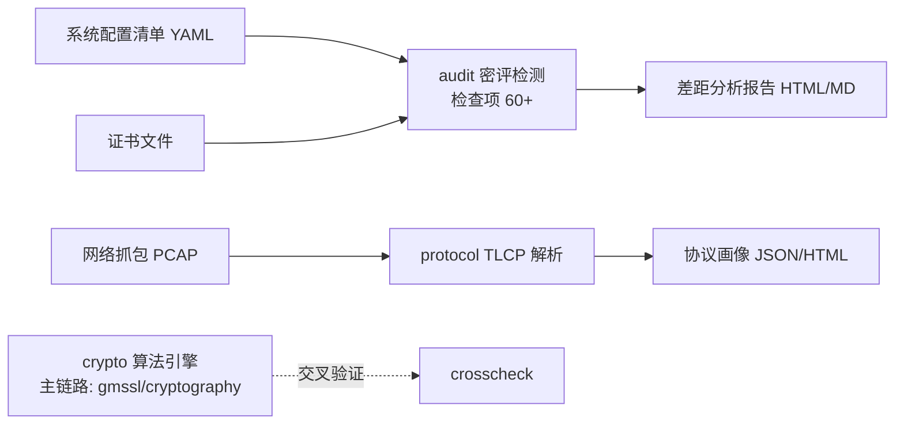

# GMScope · 国密应用安全检测与协议分析平台

> GMScope — an open-source toolkit for inspecting GM/T (Chinese commercial cryptography) applications: algorithm self-check, TLCP protocol analysis, and cryptography-compliance (密评) auditing.

[](https://github.com/maoshenghe2-debug/GMScope/actions/workflows/ci.yml)
[](LICENSE)
[](pyproject.toml)

GMScope 从**算法正确性**（SM2/SM3/SM4）、**协议合规性**（TLCP / 国密 TLS）、**配置安全性**（GB/T 39786 密评检查）三个层次对信息系统进行密码应用检测，并输出可追溯到标准条款的差距分析报告。

**快速上手（离线可跑）：**

```bash
# ① 安装（本机无 pip，统一 uv；Python 3.11）
uv venv --python 3.11
uv pip install -e ".[all]"

# ② 标准向量自检（GM/T 0002 / GM/T 0004 附录示例 + 自建 KAT）
gmscope selftest

# ③ 与成熟库交叉验证（gmssl / cryptography 双库对照）
gmscope crosscheck

# ④ 性能基准（本库 vs 参考库；--full 完整数据集）
gmscope bench

# ⑤ TLCP 协议画像（内置合成样本，离线可跑）
gmscope tlcp-fixture demo.pcap
gmscope parse demo.pcap
```

## 功能一览（v0.2.0-dev）

- ✅ **SM3 参考实现**：纯 Python（GB/T 32905 / GM/T 0004），含 HMAC-SM3，通过标准向量
- ✅ **SM4 参考实现**：ECB / CBC / CTR / **GCM（认证加密）** + PKCS#7（GB/T 32907 / GM/T 0002），通过标准向量（含百万次迭代向量，`--slow`）
- ✅ **SM2 套件**（gmssl 内核封装）：签名 / 验签 / 加解密；支持**注入随机数 k** 的确定性签名；解密**补强 C3 完整性校验**；DER 签名编解码（OpenSSL 互操作）
- ✅ **自建 KAT 冻结向量**：SM2 经 OpenSSL 双向互验、SM4-GCM 经 cryptography 交叉验证（`scripts/gen_kat.py` 可复现）
- ✅ **交叉验证**：`gmscope crosscheck` 与 `gmssl`、`cryptography` 双库对照（SM3 / SM4 / SM4-GCM / SM2 · 随机用例批量比对）
- ✅ **性能基准**：`gmscope bench`（SM3 / SM4(ECB/CBC/GCM) / SM2，本库 vs 参考库）
- ✅ **TLCP 离线解析**：记录层 / 握手（ClientHello / ServerHello / 双证书识别 · SM2 OID 检测）；`gmscope parse <pcap|bin>` 协议画像（`--json`）；`gmscope tlcp-fixture` 全合成演示样本生成器
- 🔜 v0.2.0：API 文档 · 更多演示素材
- 🔜 v0.5.0：密评检查项引擎（GB/T 39786 四个层面 60+ 检查项）+ HTML 差距分析报告
- 🔜 v1.0.0：侧信道测评演示 · 密钥管理演示 · HTTP API · 完整文档与演示素材

## 设计说明（不重复造轮子）

- 算法主链路使用成熟库（`gmssl` / `cryptography`）；本仓库内的 SM2/SM3/SM4 为**教学对照实现**，用于交叉验证与文档讲解；
- 复用策略与选型依据见项目规划文档（复用调研）：高 star 框架优先、许可红线（AGPL/LGPL/GPL 仅子进程调用）。

## 架构（规划）



## 合规声明

- 本项目用于**合规检测与学术研究**；在线探测功能默认关闭且需显式授权参数；
- 不提供任何绕过密码保护、伪造签名、攻击系统的方法；
- 使用者需遵守《密码法》《网络安全法》等法律法规，仅对自有或已授权的系统进行检测。

## 许可

[Apache-2.0](LICENSE) · 第三方组件清单见 [THIRD_PARTY_NOTICES.md](THIRD_PARTY_NOTICES.md) · 变更记录见 [CHANGELOG.md](CHANGELOG.md)

---

**作者**：Maosheng He（何茂生）· GitHub [@maoshenghe2-debug](https://github.com/maoshenghe2-debug)
